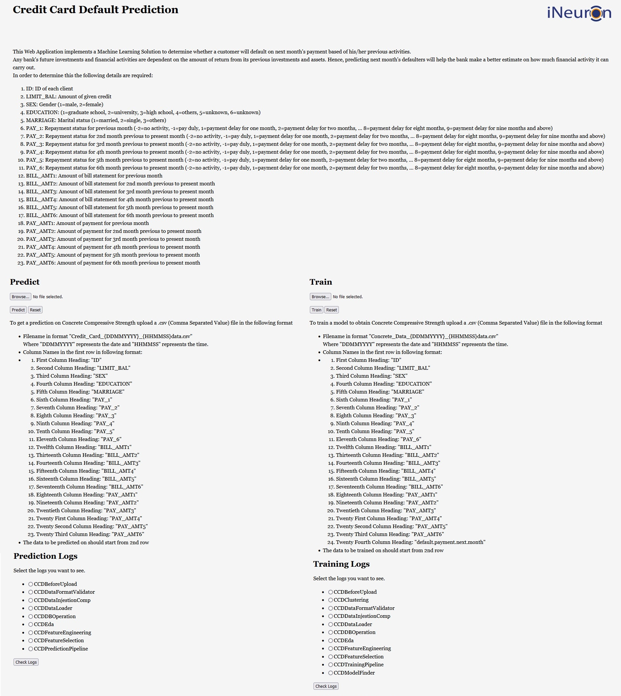
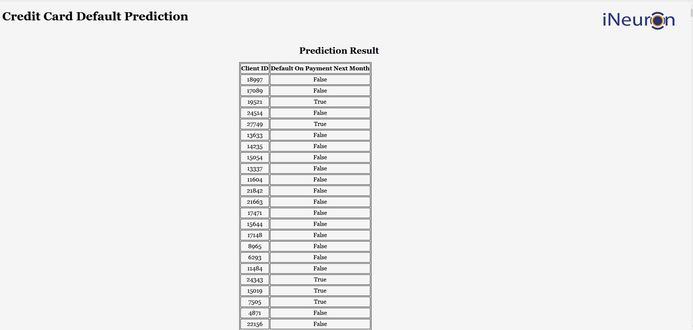

# **Credit Card Default Prediction**



* This repository implements "Credit Card Default Prediction" project work done through internship under ineuron.ai.
* With the help of this project we can estimating whether a bank client will default on his/her payment of credit card bills for the next month.

## **Description**
* This implementation requires twenty three inputs from a user in an Comma Separated Value (.csv) file which the user can upload through the web application. The inputs are described below:
    1. “ID" (input) - ID of each client
    2. "LIMIT_BAL" (input) - Amount of given credit
    3. “SEX” (input) - Gender (1=male, 2=female)
    4. “EDUCATION” (input) - (1=graduate school, 2=university, 3=high school, 4=others, 5=unknown, 6=unknown)
    5. “MARRIAGE”(input) - Marital status (1=married, 2=single, 3=others)
    6. “PAY_1” (input) - Repayment status for previous month (-2=no activity, -1=pay duly, 1=payment delay for one month, 2=payment delay for two months, … 8=payment delay for eight months, 9=payment delay for nine months and above)
    7. “PAY_2” (input) - Repayment status for 2nd month previous to present month (-2=no activity, -1=pay duly, 1=payment delay for one month, 2=payment delay for two months, … 8=payment delay for eight months, 9=payment delay for nine months and above)
    8. “PAY_3” (input) - Repayment status for 3rd month previous to present month (-2=no activity, -1=pay duly, 1=payment delay for one month, 2=payment delay for two months, … 8=payment delay for eight months, 9=payment delay for nine months and above)
    9. “PAY_4” (input) - Repayment status for 4th month previous to present month (-2=no activity, -1=pay duly, 1=payment delay for one month, 2=payment delay for two months, … 8=payment delay for eight months, 9=payment delay for nine months and above)
    10. “PAY_5” (input) - Repayment status for 5th month previous to present month (-2=no activity, -1=pay duly, 1=payment delay for one month, 2=payment delay for two months, … 8=payment delay for eight months, 9=payment delay for nine months and above)
    11. “PAY_6” (input) - Repayment status for 6th month previous to present month (-2=no activity, -1=pay duly, 1=payment delay for one month, 2=payment delay for two months, … 8=payment delay for eight months, 9=payment delay for nine months and above)
    12. “BILL_AMT1” (input) - Amount of bill statement for previous month
    13. “BILL_AMT2” (input) - Amount of bill statement for 2nd month previous to present month
    14. “BILL_AMT3” (input) - Amount of bill statement for 3rd month previous to present month
    15. “BILL_AMT4” (input) - Amount of bill statement for 4th month previous to present month
    16. “BILL_AMT5” (input) - Amount of bill statement for 5th month previous to present month
    17. “BILL_AMT6” (input) - Amount of bill statement for 6th month previous to present month
    18. “PAY_AMT1” (input) - Amount of payment for previous month
    19. “PAY_AMT2” (input) - Amount of payment for 2nd month previous to present month
    20. “PAY_AMT3” (input) - Amount of payment for 3rd month previous to present month
    21. “PAY_AMT4” (input) - Amount of payment for 4th month previous to present month
    22. “PAY_AMT5” (input) - Amount of payment for 5th month previous to present month
    23. “PAY_AMT6” (input) - Amount of payment for 6th month previous to present month

* The output is represented in a tabular form along with the corresponding "ID".
* The Web Application which implements this repository also provides the facility to retrain the model used to predict the heating and cooling load. 
* We can also see the logs to understand whether the application is working properly.

## **Workflow**


## **Dataset**
* The dataset used for training the model is available [here](https://www.kaggle.com/datasets/uciml/default-of-credit-card-clients-dataset)

## **Installation**

### **Requirements**

* Python 3.5+
* scikit-learn 0.24.2
* xgboost 0.90
* pandas 1.0.0
* numpy 1.19.5
* Flask 1.1.1
* cassandra-driver 3.25.0

### **Setup**
1. Install Machine Learning Libraries
```
pip install scikit-learn==0.24.2 xgboost==0.90 pandas==1.0.0
```
2. Install Library for hosting Web Application on heroku
```
pip install Flask==1.1.1
```
3. Install Database interface libary
```
pip install cassandra-driver==3.25.0
```
4. Install supporting libraries
```
pip install pandas==1.0.0 numpy==1.19.5
```


## **Implementation**
* A working implementation of the project as a Web Application in this repository is available [here](https://cc-defaulter-project-joma.herokuapp.com/)

## **Contributors**
* [Jobin Mathew](https://www.linkedin.com/in/jobin-mathew-78b782149/)
* [Vineet Kumar]()


